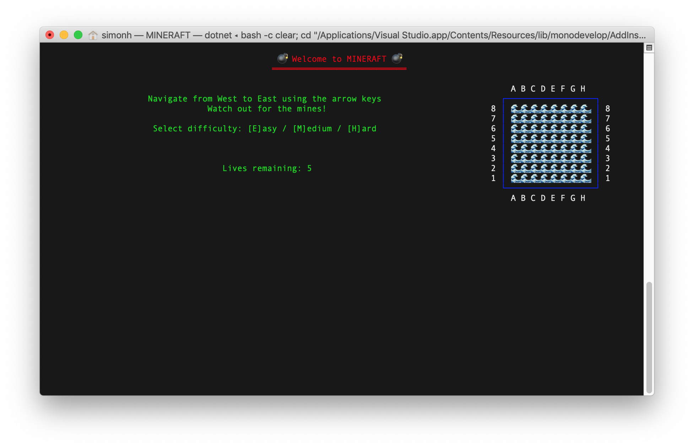
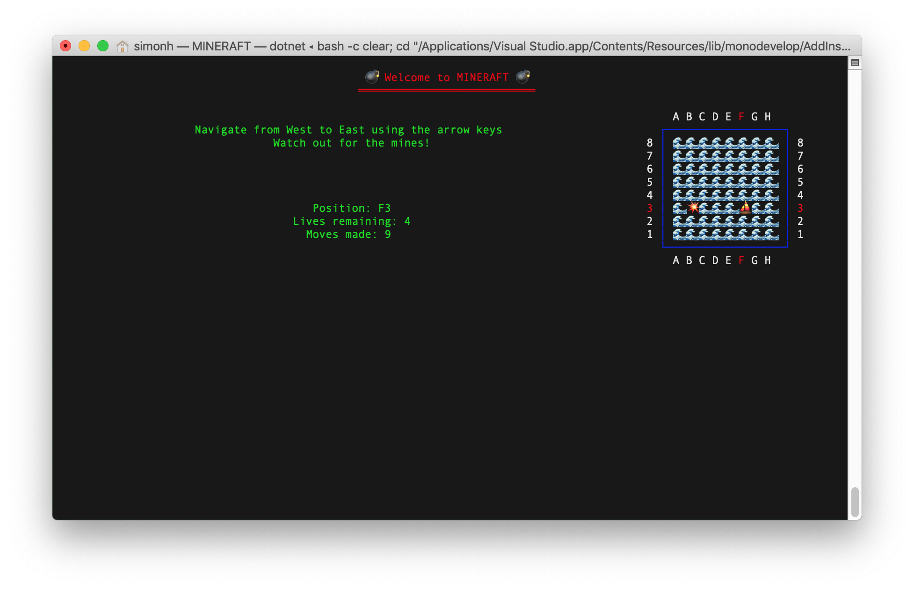
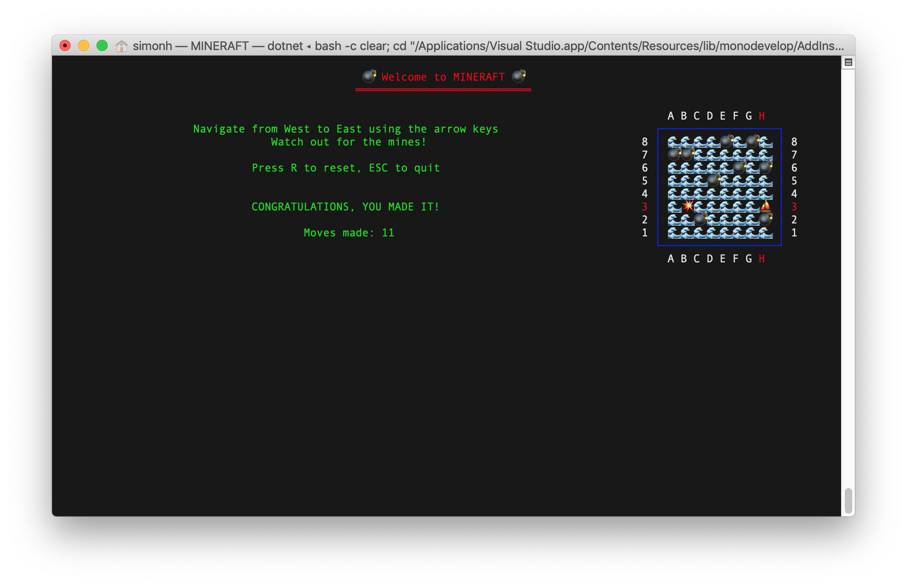
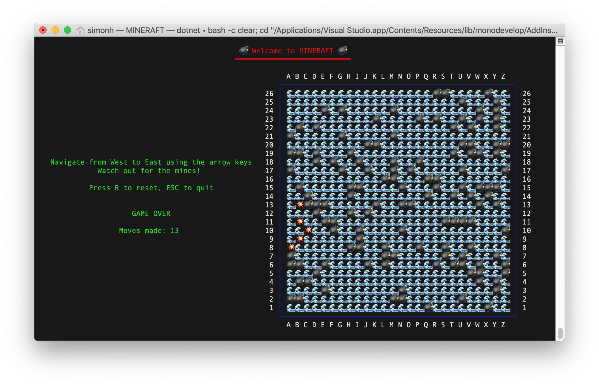

# MINERAFT 
This is a simple console app written in .NET Core 2.2. The player needs to navigate their raft from left to right (West to East) while avoiding the hidden mines. 5 lives are available and the game includes 3 difficulty settings.

Emojis are used to represent features of the game board. You'll need macOS or Windows 10 >=1809 for this to work. Future builds may include better cross-platform support.

## Usage
1. Compile the code using dotnet, VSCode, Visual Studio for Mac, or Visual Studio 2019 - the only requirement is .NET Core 2.2 SDK
2. Run mineraft.dll via terminal/command line or debug from your IDE of choice
3. Follow the on-screen instructions to play the game. Press R to reset or ESC to quit at any time.

## Todo
- More unit tests
- More refactoring
